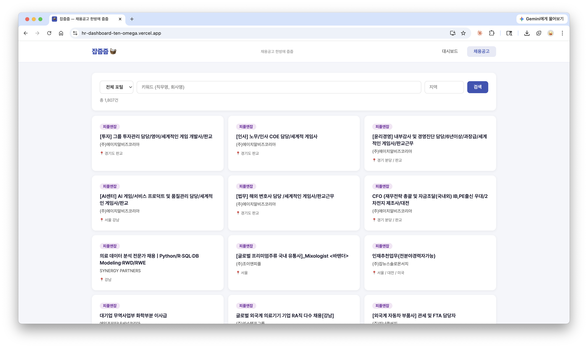
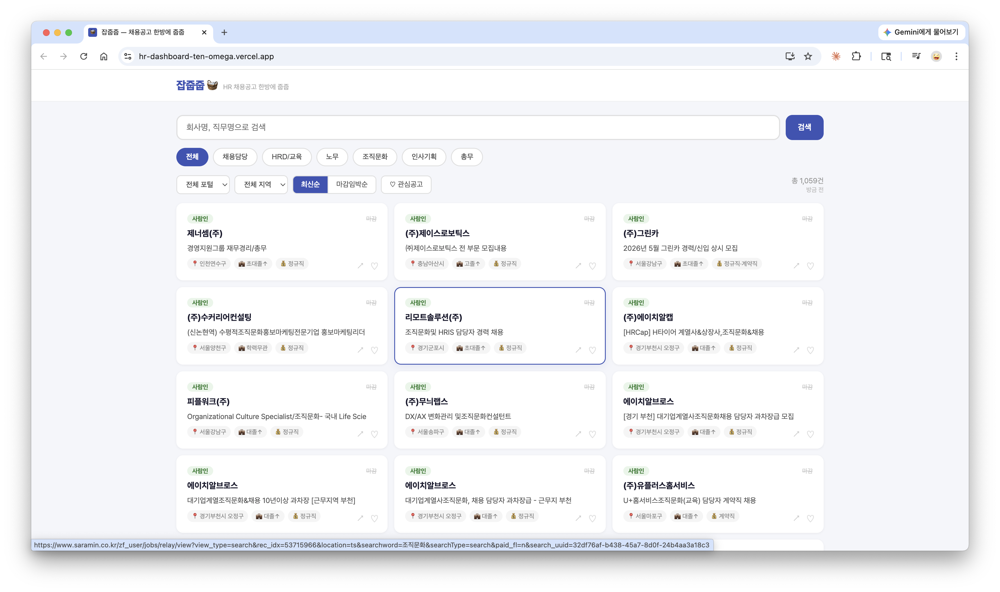
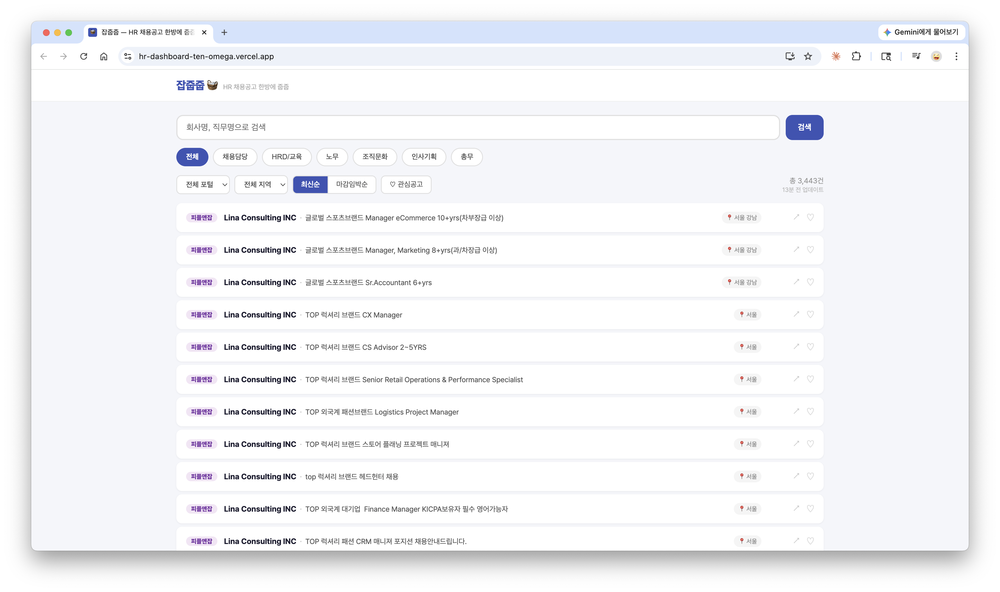
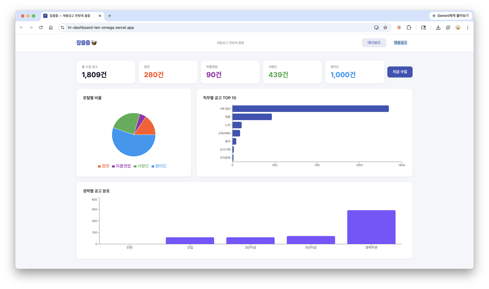

# 잡줍줍 🧺

> HR 취준생을 위한 채용공고 통합 검색 서비스

사람인 · 원티드 · 점핏 · 피플앤잡의 HR 채용공고를 자동으로 수집해 한 곳에서 검색할 수 있게 만든 웹 서비스입니다.  
채용담당 · HRD · 노무 · 조직문화 · 인사기획 · 총무 직무별 필터와 마감일 D-day, 북마크 기능을 제공합니다.

**배포 URL:** https://hr-dashboard-ten-omega.vercel.app

<br>

## 기획 의도

HR 직무를 준비하는 취준생으로서 매일 여러 채용 포털을 따로 들어가 확인하는 번거로움을 직접 경험했습니다.  
사람인, 원티드, 점핏, 피플앤잡을 번갈아 가며 비슷한 검색을 반복하는 대신, **한 페이지에서 HR 공고만 모아 볼 수 있는 서비스**를 직접 만들었습니다.

- HR 직무에 특화된 공고만 자동 분류
- 마감일 D-day를 한눈에 확인
- 링크 클릭 한 번으로 원본 포털로 이동
- 로그인 없이 북마크 저장 (localStorage)

> 이 프로젝트는 Claude Code(AI)와 함께 바이브코딩 방식으로 개발했습니다.  
> 기획·설계·코드 작성·배포까지 전 과정을 AI와 협업하며 완성한 포트폴리오 프로젝트입니다.

<br>

## 주요 기능

| 기능 | 설명 |
|------|------|
| 멀티 포털 수집 | 사람인·원티드·점핏·피플앤잡 공고를 6시간마다 자동 수집 |
| 직무별 필터 | 채용담당·HRD·노무·조직문화·인사기획·총무 카테고리 탭 |
| 포털/지역 필터 | 포털사 및 서울·경기·부산 등 지역별 필터 |
| 정렬 | 최신순 / 마감임박순 전환 |
| D-day 뱃지 | 마감일 기반으로 D-day·상시·마감 상태 자동 표시 |
| 북마크 | 로그인 없이 관심 공고 저장 (localStorage) |
| 링크 공유 | 공고 URL 클립보드 복사 버튼 |
| 업데이트 시각 | 마지막 데이터 수집 시각 표시 |
| 서버 웜업 | Render 무료 서버 cold start 시 자동 재시도 + 안내 메시지 |
| 통계 대시보드 | 포털별 비율, 직무별 공고 수, 경력별 분포 차트 |
| PWA | 모바일 홈 화면 추가 지원 |

<br>

## 기술 스택

### 백엔드
| | |
|---|---|
| **언어 / 프레임워크** | Python 3.11, FastAPI |
| **DB** | SQLite + SQLAlchemy (async) |
| **스케줄러** | APScheduler (6시간 주기 자동 수집) |
| **스크래핑** | httpx, BeautifulSoup4, lxml |
| **배포** | Render (무료 플랜) |

### 프론트엔드
| | |
|---|---|
| **프레임워크** | React 18 + Vite |
| **차트** | Recharts |
| **PWA** | vite-plugin-pwa |
| **배포** | Vercel |

### 인프라
- **UptimeRobot** — Render 무료 서버 5분 주기 ping (슬립 방지)
- **GitHub** — 코드 저장소, Vercel/Render 자동 배포 연동

<br>

## 수집 현황

| 포털 | 방식 | 수집 규모 |
|------|------|-----------|
| 원티드 | 공개 API | 인사/총무 그룹 최대 1,000건 |
| 점핏 | 공개 API | HR 직군 최대 300건 |
| 피플앤잡 | HTML 스크래핑 | HR 키워드 검색 결과 |
| 사람인 | HTML 스크래핑 | HR 키워드 15종 × 5페이지 |

> 사람인 공식 API 승인 대기 중 — 승인 시 더 많은 공고 수집 예정

<br>

## 프로젝트 구조

```
hr-dashboard/
├── backend/
│   ├── main.py          # FastAPI 앱, /api/jobs, /api/stats 엔드포인트
│   ├── models.py        # SQLAlchemy JobPosting 모델
│   ├── database.py      # DB 초기화, 세션 관리
│   ├── collect.py       # 수집 오케스트레이터, 30일 초과 공고 자동 정리
│   ├── scheduler.py     # APScheduler 6시간 주기 설정
│   └── scrapers/
│       ├── wanted.py        # 원티드 API
│       ├── jumpit.py        # 점핏 API
│       ├── saramin_html.py  # 사람인 HTML 스크래핑
│       └── peoplenjob.py    # 피플앤잡 HTML 스크래핑
├── frontend/
│   ├── src/
│   │   ├── App.jsx
│   │   ├── components/
│   │   │   ├── JobList.jsx   # 채용공고 목록 (필터, 검색, 북마크)
│   │   │   └── Dashboard.jsx # 통계 대시보드
│   │   ├── api.js
│   │   └── index.css
│   └── index.html
└── render.yaml          # Render 배포 설정
```

<br>

## 로컬 실행

### 백엔드
```bash
cd backend
pip install -r requirements.txt
uvicorn main:app --reload
# → http://localhost:8000
```

### 프론트엔드
```bash
cd frontend
npm install
npm run dev
# → http://localhost:5173
```

환경변수 (`backend/.env`):
```
ALLOWED_ORIGINS=http://localhost:5173
```

<br>

## 스크린샷

### 채용공고 목록 — 리스트 뷰






### 통계 대시보드


<br>

## 개발하면서 배운 점

- 무료 인프라(Render + Vercel)의 한계를 직접 경험하고, cold start 문제를 UptimeRobot + 프론트엔드 재시도 로직으로 해결하는 실용적인 방법을 익혔습니다.
- 포털마다 응답 형식(JSON API vs HTML)이 달라 스크래퍼를 각각 구현했고, JS 렌더링 사이트(잡코리아·인크루트)는 httpx로 접근이 불가능함을 확인했습니다.
- AI(Claude Code)와의 바이브코딩으로 기획부터 배포까지 완성하며, AI를 활용한 빠른 프로토타이핑과 반복 개선 사이클을 경험했습니다.

<br>

---

만든 사람: **밍수박사** · [LinkedIn](https://www.linkedin.com/in/minsooim)
